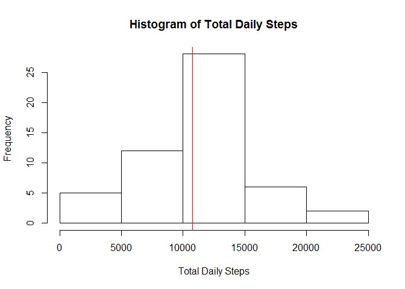
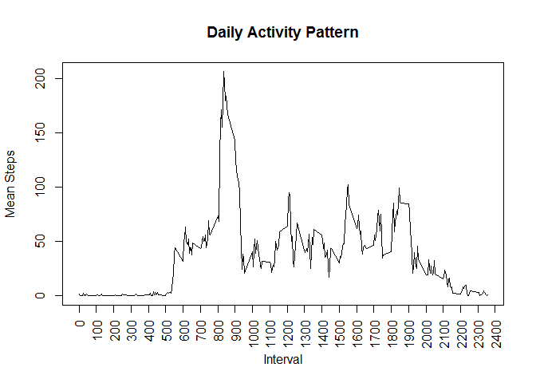

# Reproducible Research: Peer Assessment 1


```r
options(scipen = 1, digits = 2)
```
## Loading and preprocessing the data


```r
activity <- read.csv("activity.csv")
```

Process/transform the data (if necessary) into a format suitable for your analysis

```r
activity$date <- as.Date(activity$date)
```


## What is mean total number of steps taken per day?


For this part of the assignment, you can ignore the missing values in the dataset.

Calculate the total number of steps taken per day


```r
stepStats <- aggregate(cbind("sumDailySteps" = steps) ~ date, data = activity, function(x) sum(x,na.rm = TRUE))
meanDailySteps <- round(mean(stepStats$sumDailySteps),3)
medianDailySteps <- median(stepStats$sumDailySteps)
```

Make a histogram of the total number of steps taken each day


```r
hist(stepStats$sumDailySteps, main="Histogram of Total Daily Steps", xlab="Total Daily Steps")

# Mean - Red Line
abline(v=meanDailySteps, col='red', lwd=1)
```

 

Calculate and report the mean and median of the total number of steps taken per day


```r
print(paste("Mean Daily Steps :", as.character(meanDailySteps)))
```

```
## [1] "Mean Daily Steps : 10766.189"
```

```r
print(paste("Median Daily Steps :", as.character(medianDailySteps)))
```

```
## [1] "Median Daily Steps : 10765"
```


## What is the average daily activity pattern?

Make a time series plot (i.e. type = "l") of the 5-minute interval (x-axis) and the average number of steps taken, averaged across all days (y-axis)


```r
library(plyr)
intervalMeanSummary <- ddply(activity, .(interval), summarize, mean = mean(steps, na.rm=TRUE))

plot(intervalMeanSummary, type="l", xlab="Interval", ylab="Mean Steps", main="Daily Activity Pattern", col=1, xaxt="n")
axis(1, at = seq(0, 3000, by = 100), las=2)
```

 

Which 5-minute interval, on average across all the days in the dataset, contains the maximum number of steps?

```r
maxInterval <- intervalMeanSummary[which.max(intervalMeanSummary$mean),]
print(maxInterval)
```

```
##     interval mean
## 104      835  206
```


## Imputing missing values

Note that there are a number of days/intervals where there are missing values (coded as NA). The presence of missing days may introduce bias into some calculations or summaries of the data.

Calculate and report the total number of missing values in the dataset (i.e. the total number of rows with NAs)

```r
print(paste("Total Missing Values in Dataset :", as.character(nrow(activity)-sum(complete.cases(activity$steps)))))
```

```
## [1] "Total Missing Values in Dataset : 2304"
```

Devise a strategy for filling in all of the missing values in the dataset. The strategy does not need to be sophisticated. For example, you could use the mean/median for that day, or the mean for that 5-minute interval, etc.

Create a new dataset that is equal to the original dataset but with the missing data filled in.

```r
#add new columns with sums and means
library(plyr)
activity <- ddply(activity,.(date),transform,sumStepsPerDay = sum(steps, na.rm = TRUE))
activity <- ddply(activity,.(date),transform,meanIntervalStepsByDate = mean(steps, na.rm = TRUE))
activity <- ddply(activity,.(interval),transform,meanStepsByInterval = mean(steps, na.rm = TRUE))

#add column with imputed mean steps by interval count if data in steps is NA
activity$imputedSteps <- 0
for (i in 1:nrow(activity)){
if (is.na(activity[i,1])) {activity[i,7] <- round(activity[i,6],0)} else {activity[i,7] <- activity[i,1]}
}
```

Make a histogram of the total number of steps taken each day and Calculate and report the mean and median total number of steps taken per day. 

Do these values differ from the estimates from the first part of the assignment? What is the impact of imputing missing data on the estimates of the total daily number of steps?


```r
stepStatsImputed <- aggregate(cbind("sumDailySteps" = imputedSteps) ~ date, data = activity, sum)
meanDailyStepsImputed <- round(mean(stepStatsImputed$sumDailySteps),3)
medianDailyStepsImputed <- median(stepStatsImputed$sumDailySteps)

print(paste("Mean Daily Steps with Imputed Values :", as.character(meanDailyStepsImputed)))
```

```
## [1] "Mean Daily Steps with Imputed Values : 10765.639"
```

```r
print(paste("Median Daily Steps with imputed values :", as.character(medianDailyStepsImputed)))
```

```
## [1] "Median Daily Steps with imputed values : 10762"
```

There is minimal impact of imputing missing data on the estimates of the total daily number of steps.

Mean without imputing 10766.19 and with imputing 10765.64. 

Median without imputing 10765 and with imputing 10762. 


```r
hist(stepStatsImputed$sumDailySteps, main="Histogram of Total Daily Steps with Imputed Values", xlab="Total Daily Steps")
# Mean - Red Line
abline(v=meanDailyStepsImputed, col='red', lwd=1)
```

 


## Are there differences in activity patterns between weekdays and weekends?


For this part the weekdays() function may be of some help here. Use the dataset with the filled-in missing values for this part.

Create a new factor variable in the dataset with two levels - "weekday" and "weekend" indicating whether a given date is a weekday or weekend day.


```r
activity$dayWeek <- factor(weekdays(activity$date))
levels(activity$dayWeek) <- list(weekday = c("Monday", "Tuesday", "Wednesday","Thursday", "Friday"),weekend = c("Saturday", "Sunday"))
```

Make a panel plot containing a time series plot (i.e. type = "l") of the 5-minute interval (x-axis) and the average number of steps taken, averaged across all weekday days or weekend days (y-axis).


```r
intervalMeanSummaryImputed <- ddply(activity, .(interval, dayWeek), summarize, meanImputedSteps = mean(imputedSteps))

library(lattice)
xyplot(meanImputedSteps ~ interval | dayWeek, intervalMeanSummaryImputed, type = "l", layout = c(1, 2), 
    xlab = "Interval", ylab = "Number of steps")
```

 

There are differences in the activity patterns for weekdays and weekends. From the plot it appears that on weekdays after an initial spike at interval 800 the step activity settles down and stabilizes at interval 1000. In contrast on weekends there is no such settling down of the step activity at interval 1000.

